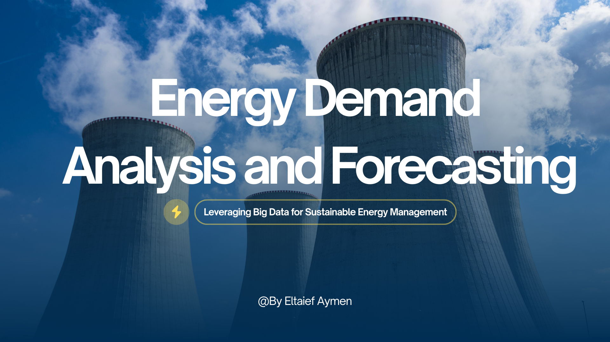
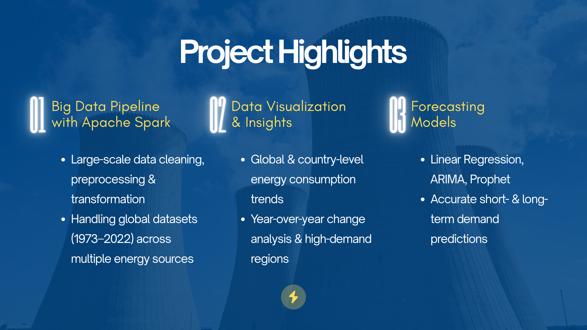

# ⚡ Energy Demand Analysis & Forecasting  
*Leveraging Big Data for Sustainable Energy Management*  

## 📌 Project Overview  
This project leverages **Apache Spark** to analyze and forecast global energy consumption trends from **1973 to 2022**.  
It demonstrates the power of big data pipelines for **cleaning, visualizing, and forecasting** large-scale datasets, enabling better decision-making in energy management and sustainability.  

---

   
   

---

## 🔑 Key Features  
- **Big Data Processing**: Built with Apache Spark for large-scale data preprocessing and transformation.  
- **Data Visualization**: Created global & country-level insights with Matplotlib, Seaborn, and Plotly.  
- **Forecasting Models**: Implemented Linear Regression, ARIMA, and Prophet to predict short- and long-term energy demand.  
- **Insights**: Identified high-consumption countries, year-over-year changes, and long-term global trends.  

---

## 🛠️ Tech Stack  
- **Big Data & Processing**: Apache Spark, PySpark, Spark SQL  
- **Machine Learning**: ARIMA, Prophet, Regression Models  
- **Visualization**: Matplotlib, Seaborn, Plotly  
- **Data Engineering**: Cleaning, reshaping, feature engineering  

---

## 🌍 Impact  
This project highlights how **AI + Big Data** can support **sustainable energy planning**.  
By forecasting energy demand, it provides actionable insights for:  
- Governments to optimize energy policies  
- Enterprises to plan resource allocation  
- Sustainability efforts in transitioning to renewables  

---

## 👨‍💻 Author  
**Eltaief Aymen**  
AI & Data Science Engineer 

---
